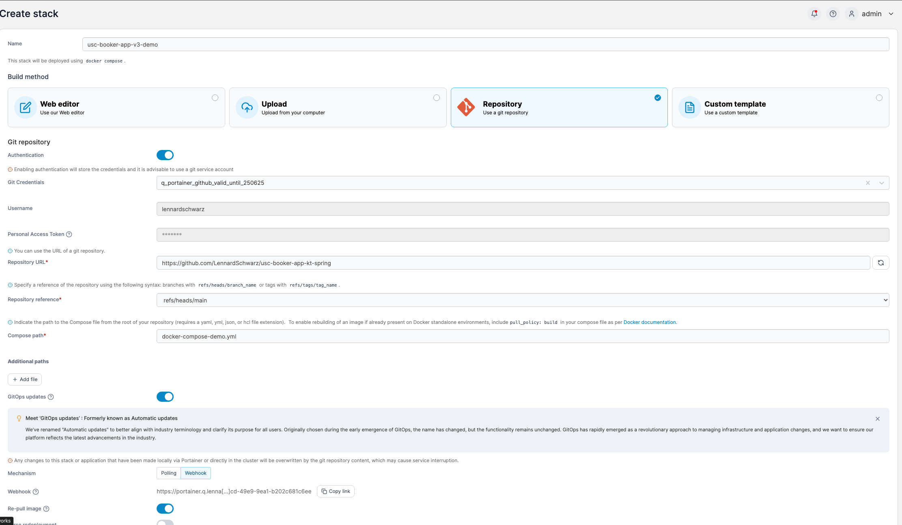

# Lucipedia

Wikipedia clone where all content is AI generated.

Check it out here: [lucipedia.lenn.rocks](https://lucipedia.lenn.rocks)

## Deployment

The project is deployable as a whole via various docker compose configurations.

- Use `docker-compose-dev.yml` for local testing.
- Use `docker-compose-prod.yml` for production deployment via Portainer.

### Deployment Notes

The following notes are mostly for myself to remember how to deploy the application.

#### Infrastructure

Deploy stack via Portainer with the following settings:

Inject environment variables via Portainer GUI. See the [.env.example](.env.example).

Deployed environment variables are saved in my password manager.

##### Updown Healthcheck

- Add health check in [updown.io](https://updown.io/)

#### CI/CD

The project rebuilds and deploys to different environments via [Github Actions](.github/workflows/rebuild-prod-environment.yml).

See the workflows for the secrets needed in Github.
